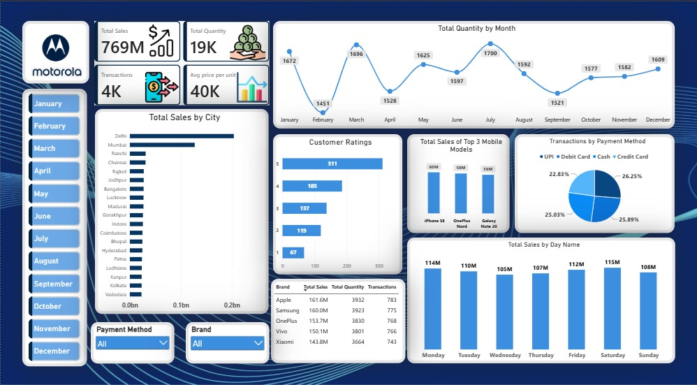

# Mobile Sales Dashboard | Power BI

An interactive Power BI dashboard analysing mobile phone sales across brands, cities, payment methods and time, built to practise end-to-end BI skills: data modelling, DAX, visual design and storytelling.

**[▶ Watch the 90-second demo](Mobile_Sales_Dashboard_demo.mp4)**

## Business questions answered
- How much did we sell overall, and how does it change month by month?
- Which brands, mobile models and cities drive the most sales?
- Does sales performance change across the days of the week?
- How do customers pay, and how do they rate their purchase?

## Key numbers
| Metric | Value |
|---|---|
| Total sales | 769M |
| Total quantity | 19K units |
| Transactions | 4K |
| Avg price per unit | 40K |

## Insights
- **Brands are closely matched.** Apple leads with 161.6M, followed by Samsung (160.0M), OnePlus (153.7M), Vivo (150.1M) and Xiaomi (143.8M). The gap between first and last is only about 12%.
- **Sales are steady across the week.** Daily sales stay between 105M and 115M, with Saturday highest and Wednesday lowest, so there's no real weekday trend.
- **Quantity peaks in March and July** (1,696 and 1,700 units) and dips in February (1,451).
- **Payment methods are evenly split**, with each method taking roughly 23% to 26% of transactions.
- **Customers are happy.** 5-star ratings are the largest group (311 of 819 ratings, about 38%).
- **Delhi and Mumbai** are the strongest cities by sales.

## Dashboard features
- Month slicer buttons plus Payment Method and Brand dropdowns, all cross-filtering every visual
- KPI cards for sales, quantity, transactions and average price per unit
- Monthly quantity trend, sales by city, customer ratings, top 3 models, payment mix and sales by day of week
- Brand summary table with formatted values

## Tools used
- Power BI Desktop
- DAX (custom column for weekday ordering: `Day Number = SWITCH('Sales_Data'[Day Name], "Monday", 1, ..., "Sunday", 7)`)
- Microsoft Excel (source data)

## Data
- Source: `Mobile_Sales_Data.xlsx` (sample dataset, not real company data)
- Period: [06-10-2026] to [07-10-2026]
- Records: 3835 rows

## Files
| File | What it is |
|---|---|
| `Mobile_Sales_project.pbix` | The Power BI project. Open it in Power BI Desktop |
| `Mobile_Sales_Data.xlsx` | The dataset |
| `Mobile_Sales_Dashboard_png.jpeg` | Dashboard screenshot |
| `Mobile_Sales_Dashboard_demo.mp4` | Screen recording of the filters in action |

## Notes
Practice project built with sample data. The logo is used for design purposes only; this project is not affiliated with Motorola.

## Author
**Oishi Bhattacharya** · [LinkedIn](https://www.linkedin.com/in/oishi-bhattacharya-/?isSelfProfile=true)
